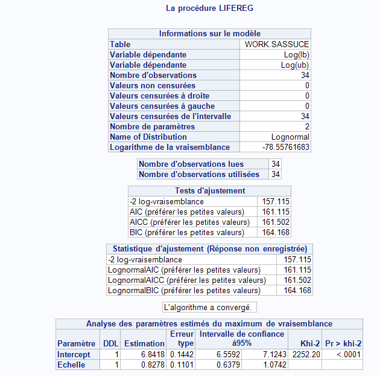

```{r setup, include=FALSE}
knitr::opts_chunk$set(echo = TRUE)
```

# Numéro 1

## a)
On sait que
$$
X \sim LN(\mu,\sigma^2)
$$
d'où
$$
f(x;\mu,\sigma^2) = \frac{1}{x\sqrt{2\pi\sigma^2}}e^{- \frac{(ln(x)-\mu)^2}{2\sigma^{2}}}
$$
La formule de la vraisemblance est donc la suivante:
$$
\begin{aligned}
L(\mu,\sigma) =& \prod_{i=1}^{n} f(x_{i};\mu,\sigma^2)\\
=& \prod_{i=1}^{n} \frac{1}{x_{i}\sqrt{2\pi\sigma^2}}\exp({- \frac{(ln(x_{i})-\mu)^2}{2\sigma^{2}}})\\
=& \frac{1}{(2\pi\sigma^2)^{n/2}} \prod_{i=1}^{n} \left\{\frac{1}{x_{i}}\right\}\exp^{-\frac{1}{2} \sum_{i=1}^{n} \frac{(ln(x_{i})-\mu)^2}{\sigma^{2}}}\\
\end{aligned}
$$
Donc la log-vraisemblance est la suivante : 
$$
\begin{aligned}
l(\mu,\sigma) =& -\frac{n}{2}\ln{(2\pi\sigma^2)} - \sum_{i=1}^{n}\ln{(x_{i})} - \frac{\sum_{i=1}^{n}(\ln{(x_{i})}- \mu)^2}{2\sigma^2}\\
=& -\frac{n}{2}\ln{(2\pi\sigma^2)} - \sum_{i=1}^{n}\ln{(x_{i})} - \frac{\sum_{i=1}^{n}[\ln{(x_{i})}^2-2\ln{(x_i)}\mu+ \mu^2]}{2\sigma^2}\\
=& -\frac{n}{2}\ln{(2\pi\sigma^2)} - \sum_{i=1}^{n}\ln{(x_{i})} - \frac{\sum_{i=1}^{n}\ln{(x_i)}^2}{2\sigma^2} + \frac{\sum_{i=1}^{n}\ln{(x_i)}\mu}{\sigma^2} - \frac{n\mu^2}{2\sigma^2}\\
\end{aligned}
$$
Il est donc possible de trouver $\hat{\mu}$ ainsi que $\hat{\sigma^2}$ en maximisant la log-vraisemblance.Pour ce faire, il faut utiliser les dérivés partielles de la log-vraisemblance et les égaler à 0. Pour $\hat\mu$, on a donc : 
$$
\begin{aligned}
\frac{\partial l}{\partial\mu}=& \frac{\partial}{\partial\mu}\left\{-\frac{n}{2}\ln{(2\pi\sigma^2)} - \sum_{i=1}^{n}\ln{(x_{i})} - \frac{\sum_{i=1}^{n}\ln{(x_i)}^2}{2\sigma^2} + \frac{\sum_{i=1}^{n}\ln{(x_i)}\mu}{\sigma^2} - \frac{n\mu^2}{2\sigma^2}\right\}\\
=& \frac{\sum_{i=1}^{n} \ln{(x_{i})}}{\hat{\sigma^2}} - \frac{2n\hat\mu}{2\hat\sigma^2}=0\\
\rightarrow \frac{n\hat\mu}{\hat\sigma^2} =& \frac{\sum_{i=1}^{n} \ln{(x_{i})}}{\hat{\sigma^2}}\\
\rightarrow \hat{\mu} =& \frac{\sum_{i=1}^{n}\ln{(x_{i})}}{n}
\end{aligned}
$$
Il faut toutefois vérifier qu'il s'agit effectivement d'un maximum  en effectuant la dérivé seconde : 
$$
\begin{aligned}
\frac{\partial^2 l}{\partial \mu^2 } = -\frac{n}{\hat\sigma^2}
\end{aligned}
$$
ce qui est négatif pour tout x, donc il s'agit bel et bien d'un maximum.

Pour ce qui est de $\hat\sigma$ 
$$
\begin{aligned}
\frac{\partial l}{\partial \sigma^2} =& \frac{\partial}{\partial \sigma^2}\left\{-\frac{n}{2}\ln{(2\pi)} - \frac{n}{2}\ln{\sigma^2} - \sum_{i=1}^{n}\ln{(x_{i})} - \frac{\sum_{i=1}^{n}[\ln{(x_{i})}-\mu]^2}{2\sigma^2}\right\}\\
=&-\frac{n}{2\hat\sigma^2} +\frac{\sum_{i=1}^{n}[\ln{(x_{i})}-\hat\mu]^2}{2\hat\sigma^4} = 0\\
\rightarrow \hat\sigma^2 =& \frac{\sum_{i=1}^{n}[\ln{(x_{i})}-\hat\mu]^2}{n} \text{, avec  } \hat\mu \text{  trouvé précédemment }
\end{aligned}
$$
Il est assumé ici qu'il s'agit bel et bien d'un maximum.

Voici le jeu de données fournies pour ce numéro: 
```{r}
data <- c(1500,6000,3500,3800,1800,5500,4800,4200,3900,3000)
```

Avec les estimateurs trouvés précédemment on trouve $\hat\mu$ et $\hat\sigma$ avec :

```{r}
n <- length(data)
mu <- sum(log(data))/n
sigma.2 <- sum((log(data)-mu)^2)/n
sigma <- sqrt(sigma.2)
```
Ce qui donne les valeurs suivantes : $\mu$ = `r mu`, $\sigma$ = `r sigma`.

## b)

On trouve $E[(X-d)_+]$ avec :

$$
\text{Par définition, } X = e^Y\text{où} Y \sim N(\mu,\sigma^2)\text{. Posons } Y = \sigma Z + \mu .\\\\
$$
$$
\begin{aligned}
\pi_x(d)
&= E[\max(X-d;0)] \\
&= E[(X-d)*1_{\{X>d\}})] \\
&= E[X*1_{\{X>d\}}- d*1_{\{X>d\}}] \\
&= E[X*1_{\{X>d\}}] - E[ d*1_{\{X>d\}}] \\
&= E[e^{\sigma Z+\mu}*1_{\{e^{\sigma Z+\mu}> d\}}] - d*E[1_{\{Y>\ln d\}}]\\
&= e^{\mu}E[e^{\sigma Z} * 1_{\{Z > \frac{\ln(d)-\mu}{\sigma}\}}] - d *\bar F_Y(\ln(d))\\
&= e^{\mu}\int_{ \frac{\ln(d)-\mu}{\sigma}}^{\infty} e^{\sigma Z} * \frac{1}{\sqrt{2\pi}}e^{\frac{-Z^2}{2}} \, dz - d *\bar F_Y(\ln(d))\\
&= e^\mu \int_{ \frac{\ln(d)-\mu}{\sigma}}^{\infty}\frac{e^{\frac{-((Z-\sigma)^2-\sigma^2)}{2}}}{\sqrt{2\pi}} \, dz - d *\bar F_Y(\ln(d))\\
&= e^{\mu +\frac{\sigma^2}{2}} \int_{ \frac{\ln(d)-\mu}{\sigma}}^{\infty}\frac{e^{-\frac{(Z-\sigma)^2}{2}}}{\sqrt{2\pi}} \, dz - d *\bar F_Y(\ln(d))\\
&= e^{\mu +\frac{\sigma^2}{2}} P(S >  \frac{\ln(d)-\mu}{\sigma}) - d *\bar F_Y(\ln(d)), \text{ où } S \sim N(\mu = \sigma_x, \sigma = 1) \\
&= e^{\mu +\frac{\sigma^2}{2}}(1- \Phi(\frac{\ln(d)-\mu}{\sigma}-\sigma)) - d *\bar F_Y(\ln(d))\\
&= e^{\mu +\frac{\sigma^2}{2}}(1- \Phi(\frac{\ln(d)-\mu}{\sigma}-\sigma))-d*P(Z>\frac{\ln(d)-\mu}{\sigma})\\
&=e^{\mu +\frac{\sigma^2}{2}}(1- \Phi(\frac{\ln(d)-\mu}{\sigma}-\sigma)) -d(1-\Phi(\frac{\ln(d)-\mu}{\sigma}))
\end{aligned}
$$

Qui se traduit en code de la façon suivante:


```{r}
stop_loss <- function(d,mu,sigma) {
    exp(mu + (sigma^2)/2) * 
        (1 - pnorm((log(d)-mu-sigma^2)/sigma)) - 
        d*(1-pnorm((log(d)-mu)/sigma))
}

```

En exécutant ce code pour les valeurs de $d \in \{2000,2100,\dots,3000\}$,on obtient les valeurs ci-dessous:
```{r,include = F}
library(stargazer)
clean_star <- function(...){
  output <- capture.output(stargazer(...))
  output <- output[4:length(output)]
  cat(paste(output,collapse = "\n"),"\n")
}
```

\begin{table}[!htbp] \centering
\caption{}
\label{}
\begin{tabular}{@{\extracolsep{5pt}} cc}
\\[-1.8ex]\hline
$d$ & $E[(X-d)_+]$ \\
\hline \\[-1.8ex]
$2,000$ & $1,872.710$ \\
$2,100$ & $1,783.220$ \\
$2,200$ & $1,695.897$ \\
$2,300$ & $1,610.916$ \\
$2,400$ & $1,528.431$ \\
$2,500$ & $1,448.570$ \\
$2,600$ & $1,371.438$ \\
$2,700$ & $1,297.115$ \\
$2,800$ & $1,225.659$ \\
$2,900$ & $1,157.103$ \\
$3,000$ & $1,091.461$ \\
\hline \\[-1.8ex]
\end{tabular}
\end{table}

SVP VOS COMMENTAIRES . AL

## c)

On trouve la formule analytique de $E[\max(X,u)]$ comme suit:

$$
E[\min(X,u)] = E[X] - E[\max(X-d,0)] = \dots = e^{\mu + \frac{\sigma^2}{2}}\Phi(\frac{\ln u - \mu - \sigma^2}{\sigma})+u*(1-\Phi(\frac{\ln u - \mu}{\sigma}))
$$

Ce qui se calcule de la façon suivante en R:
```{r}
limited_loss <- function(x,mu,sigma) {
    exp(mu+sigma^2/2)*
        pnorm((log(x)-mu-sigma^2)/sigma) + 
        x*(1-pnorm((log(x)-mu)/sigma))
}
```

En calculant la prime limité pour les valeurs de $u \in \{3000,3100,\dots,4000\}$, on obtient les valeurs ci-dessous:

\begin{table}[!htbp] \centering 
  \caption{} 
  \label{} 
\begin{tabular}{@{\extracolsep{5pt}} cc} 
\\[-1.8ex]\hline 
$u$ & $E[\max(X,u)]$\\
\hline \\[-1.8ex] 
$3,000$ & $2,748.983$ \\ 
$3,100$ & $2,811.717$ \\ 
$3,200$ & $2,871.564$ \\ 
$3,300$ & $2,928.564$ \\ 
$3,400$ & $2,982.767$ \\ 
$3,500$ & $3,034.234$ \\ 
$3,600$ & $3,083.038$ \\ 
$3,700$ & $3,129.257$ \\ 
$3,800$ & $3,172.976$ \\ 
$3,900$ & $3,214.284$ \\ 
$4,000$ & $3,253.276$ \\ 
\hline \\[-1.8ex] 
\end{tabular} 
\end{table} 

SVP VOS COMMENTAIRES . AL
\newpage

## d)

Afin d'obtenir une estimation de l'espérance de $X$, il est possible en R de simuler $n$ fois la densité de $X$ puis de faire la moyenne empirique de la simulation. Cette méthodologie est dérivé de la loi forte des grands nombres qui stipule que $P(\lim_{n\to \infty}\sum_{i=1}^nX_i = E[X]) = 1$. Ainsi, on applique la méthodologie pour $n \in \{1\times 10^5,5 \times 10^5,1 \times 10^6\}$ avec le code qui suit :

```{r}
n <- c(1e5,5e5,1e6)
simul <- lapply(n,function(i)rlnorm(i,mu,sigma))
d <- 2000
mean_simul <- sapply(simul,function(j) mean(sapply(j,function(i) max(i-d,0))))
```
On obtient donc les valeurs suivantes:
\begin{table}[!htbp] \centering 
  \caption{Valeur empirique de $E[(X-2000)_+]$} 
  \label{} 
\begin{tabular}{@{\extracolsep{5pt}} c|ccc} 
Nombre de simulations & $1\times10^5$  & $5 \times 10^5$ & $1 \times 10^6$\\
\\[-1.8ex]
\hline \\[-1.8ex] 
Valeur de $E[(X-2000)_+]$ & $1,878.488$ & $1,874.386$ & $1,872.792$
\end{tabular} 
\end{table}


\newpage
# Numéro 2

## a)

### En R:
```{r,include = F}
load(file = "grouped.Rda")
```


```{r,eval = F}
f <- function(a,b,mu,sd){
    pnorm((log(b)-mu)/sd)-pnorm((log(a)-mu)/sd)
}

#gml : grouped maximum likelyhood

gml.data <- data.frame("a" = c(seq(0,1500,250),2000,2500,3000),
                  "b" = c(seq(250,1500,250),2000,2500,3000,5000),
                  "count" = c(3,4,5,5,4,3,3,3,2,2))

gml.fmax <- function(mu,sd){
    sum(apply(gml.data,1,function(x) x[3]*log(f(x[1],x[2],mu,sd))))
}

mu.int <- seq(6.5,7,len = 10000)
sigma.int <- seq(0,1,len = 200)

out <- sapply(mu.int, function(i) sapply(sigma.int,function(j) gml.fmax(i,j)))
coord <- which(out == max(out), arr.ind = TRUE)
values <- c(mu.int[coord[2]],sigma.int[coord[1]])
```
```{r}
values
```
\newpage
### En SAS :

{
height=95% }
\newpage
Ainsi, en se fiant à SAS, on obtient les valeurs de $\hat\mu = 6.8418$, $\hat\sigma = 0.8278$.

## b)
On réutilise le code du numéro 1 afin d'obtenir les valeurs suivantes pour $E[(X-d)_+],d \in \{2000,2100,\dots,3000\}$:

\begin{table}[!htbp] \centering 
  \caption{} 
  \label{} 
\begin{tabular}{@{\extracolsep{5pt}} cc} 
\\[-1.8ex]\hline 
$d$ & $E[(X-d)_+]$ \\
\hline \\[-1.8ex] 
$2,000$ & $253.358$ \\ 
$2,100$ & $236.165$ \\ 
$2,200$ & $220.400$ \\ 
$2,300$ & $205.921$ \\ 
$2,400$ & $192.606$ \\ 
$2,500$ & $180.344$ \\ 
$2,600$ & $169.036$ \\ 
$2,700$ & $158.594$ \\ 
$2,800$ & $148.940$ \\ 
$2,900$ & $140.004$ \\ 
$3,000$ & $131.722$ \\ 
\hline \\[-1.8ex] 
\end{tabular} 
\end{table}
\newpage


## c)

Toujours avec le code du numéro 1, on obtient les valeurs théoriques suivantes pour $E[\min(X,u)], u \in \{ 3000,3100,\dots,4000\}$
\begin{table}[!htbp] \centering 
  \caption{} 
  \label{} 
\begin{tabular}{@{\extracolsep{5pt}} cc} 
\\[-1.8ex]\hline 
$u$ & $E[\min(X,u)]$ \\
\hline \\[-1.8ex] 
$3,000$ & $1,187.010$ \\ 
$3,100$ & $1,194.694$ \\ 
$3,200$ & $1,201.832$ \\ 
$3,300$ & $1,208.469$ \\ 
$3,400$ & $1,214.647$ \\ 
$3,500$ & $1,220.404$ \\ 
$3,600$ & $1,225.773$ \\ 
$3,700$ & $1,230.786$ \\ 
$3,800$ & $1,235.470$ \\ 
$3,900$ & $1,239.851$ \\ 
$4,000$ & $1,243.952$ \\ 
\hline \\[-1.8ex] 
\end{tabular} 
\end{table}

# Numéro 3

## a)
$$
\begin{aligned}
f_{X,\Theta}(x,\theta) &= f_{X|\Theta}(x,\theta)f_\Theta(\theta) \\
&=\binom{1+x}{x}\theta^2(1-\theta)^x\frac{1}{B(2,2)}\theta(1-\theta)\\
&=\binom{1+x}{x}\theta^3(1-\theta)^{x+1}\frac{1}{B(2,2)}\\
\rightarrow l(\theta) &= \sum_{i=1}^n \log f_{X,\Theta}(x_i,\theta) \\
&= \log f_{X,\Theta}(x_1,\theta)\,\text{Car un seul X}\\
&= \log  \binom{1 + x}{x} +3 \log \theta + (x+1) \log (1-\theta) - \log B(2,2)\\
\rightarrow \frac{d}{d\theta} l(\theta) &= \frac{3}{\theta} - \frac{x+1}{1-\theta} = 0\\
\rightarrow \theta &= \frac{3}{4+x} = \frac{3}{9}
\end{aligned}
$$

## b)

```{r,echo = F}
beta <- list()
beta$a <- 2
beta$b <- 2

val <- seq(0,1,length = 100)
fx <- pbeta(val,beta$a,beta$b)
plot(val,fx,type = "l", lty=1, xlab="x",ylab = expression(f[X](x)))
```

## c)

$$
\begin{aligned}
f_{\Theta|X}(\theta|x) &= \frac{f_{X|\Theta}(x|\theta)f_\Theta(\theta)}{f_X(x)}\\
&= \frac{\binom{1+x}{x}\theta^2(1-\theta)^x\frac{1}{B(2,2)}\theta(1-\theta)}{f_X(x)}\\
&= \frac{\binom{1+x}{x}\theta^3(1-\theta)^{x+1}\frac{1}{B(2,2)}}{f_X(x)}\\
&\propto \theta^3(1-\theta)^{x+1}\\
\rightarrow \Theta|X &\sim \text{Beta}(4,x+2)\\
\rightarrow E[\Theta|X] &= \frac{4}{4+7} = 0.\overline{36}
\end{aligned}
$$

## d)
```{r}
beta_post <- list()
beta_post$a <- 4
beta_post$b <- 7

n <- 1e6
simul <- rbeta(n,beta_post$a,beta_post$b)
mean(simul)
```

